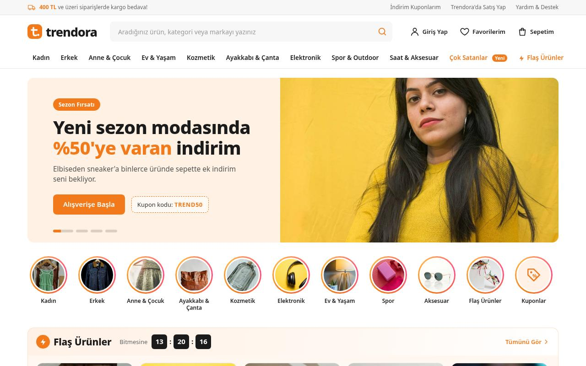

# Trendora — Trendyol-style E-commerce Homepage

A polished, fully responsive e-commerce marketplace homepage for **Trendora**, a fictional Turkish online store. It is inspired by the look and feel of large Turkish marketplaces:
- an orange accent and a wide search bar
- a category mega-menu and story-style category circles
- flash deals with a countdown
- dense product cards

The site is built with plain HTML, CSS and vanilla JavaScript, with no frameworks and no build step. The UI is in Turkish, with prices in Turkish lira format (e.g. `1.299,90 TL`).

**Live demo:** https://som-info.github.io/trendyol-style-store/



## Features

- **Header:**
  - logo and a wide search bar with live suggestions (categories and products, matched text highlighted, keyboard navigation)
  - Account, Favorites and Cart buttons with live count badges
- **Search:**
  - Turkish-aware matching, so `canta` finds *Çanta* and `gozluk` finds *Gözlük*
  - pressing Enter filters the product grid
- **Category navigation bar:**
  - mega-menus that open on hover (with hover intent), on click, or with the keyboard (↓, Esc)
  - each mega-menu has a promo card
- **Mobile drawer:** a hamburger menu with category accordions, a focus trap, and closing via Esc or a tap outside.
- **Hero banner carousel:**
  - autoplay with progress dots
  - prev/next arrows, arrow-key navigation, and touch/mouse swipe
  - autoplay pauses on hover and on keyboard focus
- **Story-style category circles:** a gradient ring that turns grey once a story is viewed (remembered).
- **Flash deals ("Flaş Ürünler"):**
  - a live countdown to midnight
  - stock-sold progress bars
  - a horizontal product rail
- **Product cards:**
  - image, brand + name, star rating and review count
  - old and discounted price with the discount %
  - badges (*Kargo Bedava*, *Hızlı Teslimat*, *Çok Satan*, *Yeni*)
  - a heart favorite toggle and add-to-cart
- **Product grid toolbar:**
  - category chips
  - quick-filter chips (free shipping, fast delivery, discounted, 4.5+ rating, favorites only)
  - sorting by price, reviews, rating and discount
  - a "load more" button and an empty state
- **Cart drawer:**
  - quantity +/- and remove
  - subtotal and shipping, with a free-shipping progress bar (400 TL threshold)
  - the total
- **Persistence:** the cart, favorites, claimed coupons and viewed stories are saved in `localStorage`.
- **"Sana Önerilenler" (recommended for you):** a rail that puts the categories of your favorites first.
- **Other sections:**
  - coupon cards
  - a benefits strip
  - an app-download banner with a decorative QR code
  - a multi-column footer that becomes an accordion on mobile
- **Accessibility:**
  - semantic landmarks and a skip link
  - ARIA states on all toggles and a combobox/listbox search
  - screen-reader text for prices and ratings
  - visible focus styles
  - `prefers-reduced-motion` support (no autoplay, no animations)
- **Responsive** at 375 px (mobile), 768 px (tablet) and 1280 px+ (desktop).

## Tech

- HTML5 (semantic markup)
- CSS3:
  - custom properties
  - Grid and Flexbox
  - `scroll-snap`
  - CSS masks for the star ratings
  - media queries
- Vanilla JavaScript (ES5+, no dependencies). The product data lives in `js/main.js`, and the grid, rails, suggestions and cart are rendered from it.
- No build step. It runs on GitHub Pages or any static host.

## Project structure

```
.
├── index.html
├── css/
│   └── style.css
├── js/
│   └── main.js
├── assets/
│   ├── logo.svg, favicon.svg
│   ├── screenshot.jpg
│   └── img/          # optimized product + banner photos
├── README.md
└── .gitignore
```

## Run locally

Open `index.html` in a browser, or serve the folder:

```bash
python3 -m http.server 8000
# then visit http://localhost:8000
```

## Deploy to GitHub Pages

Push the files to the repository root. Then go to **Settings → Pages → Deploy from a branch** and choose `main` / root.

## Credits

- Product and banner photos come from [Unsplash](https://unsplash.com) and are used under the Unsplash License. Photos showing visible brand logos were deliberately avoided.
- The logo and icons are original SVG artwork made for this project.

## Disclaimer

This is a design study for a portfolio. It is **not affiliated with, endorsed by, or connected to Trendyol** or any other marketplace. "Trendora" and all brand and product names (Velora, Nordvik, Sonique, Pera Atelier, Dermia, Fitora, Tempo, Ambra, Minibu, Lumio, Basico, Kumsal, Aurelle, Pera Home) are fictional. Prices, ratings and coupons are made up, and nothing is sold. The newsletter form does not send or store any data.

## Author

**Amir Namvar** — [GitHub @som-info](https://github.com/som-info)
